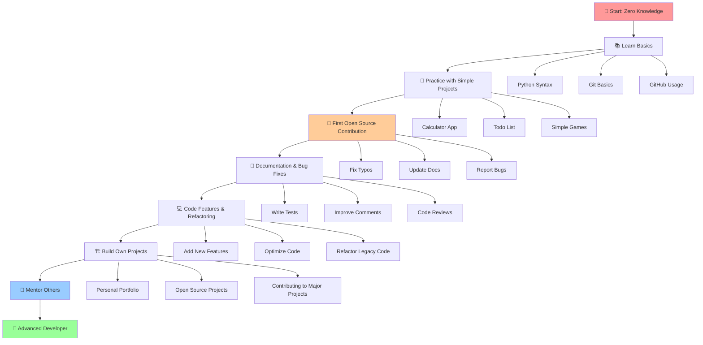
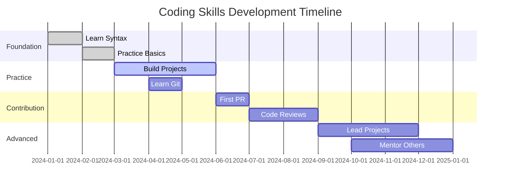

# 🎨 Visual Learning Journey

## 📊 Coding Learning Path Diagram

Berikut adalah diagram yang menunjukkan perjalanan pembelajaran coding dari pemula hingga mahir:

## 🎯 Learning Milestones

### Phase 1: Foundation (Months 1-3)
- ✅ Learn basic syntax
- ✅ Understand variables and functions
- ✅ Practice with simple exercises
- ✅ Set up development environment

### Phase 2: Practice (Months 4-6)
- ✅ Build small projects
- ✅ Learn version control (Git)
- ✅ Understand project structure
- ✅ Start using GitHub

### Phase 3: Contribution (Months 7-12)
- ✅ First open source contribution
- ✅ Learn to read existing code
- ✅ Understand project workflows
- ✅ Collaborate with maintainers

### Phase 4: Growth (Year 2+)
- ✅ Take on complex issues
- ✅ Mentor new contributors
- ✅ Lead projects
- ✅ Share knowledge

## 📈 Skills Progression

## 🎨 Visual Story Elements

### Emoji Progress Indicators
- 🚀 **Starting Point**: Beginner with no experience
- 📚 **Learning Phase**: Studying fundamentals
- 🔧 **Practice Phase**: Building small projects
- 🤝 **Contribution Phase**: First open source work
- 💻 **Development Phase**: Writing features
- 🏗️ **Building Phase**: Creating own projects
- 👥 **Mentoring Phase**: Helping others learn
- 🌟 **Mastery Phase**: Advanced developer

### Color Coding System
- 🔴 **Red**: Starting point (challenging but exciting)
- 🟠 **Orange**: Learning phase (requires patience)
- 🟡 **Yellow**: Practice phase (building confidence)
- 🟢 **Green**: Contribution phase (making impact)
- 🔵 **Blue**: Advanced phase (sharing knowledge)

## 📊 Success Metrics

| Phase | Duration | Key Achievements | Confidence Level |
|-------|----------|------------------|-------------------|
| Foundation | 1-3 months | Basic syntax, simple programs | 20% |
| Practice | 4-6 months | Small projects, Git basics | 40% |
| Contribution | 7-12 months | First PR, code reviews | 60% |
| Growth | 1+ years | Complex features, mentoring | 80% |
| Mastery | 2+ years | Project leadership, teaching | 95% |

## 🎯 Key Takeaways

1. **Start Small**: Don't try to learn everything at once
2. **Practice Daily**: Consistency is more important than intensity
3. **Join Community**: Find mentors and peers to learn with
4. **Contribute Early**: Don't wait until you're "ready"
5. **Share Knowledge**: Teaching others helps you learn too

---

*Visual elements make learning journeys more engaging and easier to understand. Use diagrams, charts, and progress indicators to track your coding adventure!* 🎨✨
